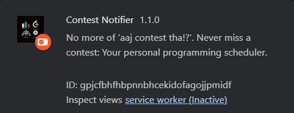

# Contest Notifier

**Contest Notifier** is a cross-browser extension designed to ensure you never miss any upcoming coding contests on various platforms like LeetCode, Codeforces, CodeChef, and AtCoder.

 

## Images

<!-- 

 -->

  
  
  

## Features

With a single click, you can:

- Visit contest pages directly.
- Integrate with Google Calendar.
- Subscribe to notifications.
- Receive a reminder 5 minutes before the contest starts.

